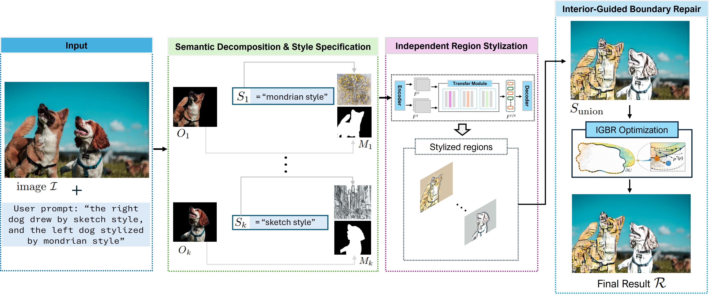

# Enhancing Multi-Region Stylization with Interior-Guided Boundary Repair

  <b>Hong-Son Nguyen and Thi-Ngoc-Hanh Le</b>

 International University, VNU-HCM

  *Corresponding author(s). E-mail(s): ltnhanh@hcmiu.edu.vn; 
  Contributing authors: sonhongnguyen.researcher@gmail.com;

Region-based neural style transfer enables fine-grained artistic control by allowing independent stylization of semantic image regions. However, compositing these regions often leads to boundary artifacts, degrading visual quality. We propose Interior-Guided Boundary Repair (IGBR), a lightweight and model-agnostic method that improves boundary handling in multi-region stylization. IGBR repairs boundary pixels using interior-guided propagation and applies inward, distance-based blending restricted to object-background boundaries, preventing inter-object style leakage. The method is derived from a region-wise constrained formulation with a closed-form solution and can be seamlessly integrated into existing stylization pipelines without retraining. To evaluate efficiency of our IGBR, we introduce quantitative metrics that measure boundary consistency, gradient artifacts, inter-object leakage, and interior preservation without requiring annotated stylized images. Our experiments and evaluations demonstrate that the proposed IGBR consistently produces plausible boundaries, outperforming prior blending techniques in boundary consistency, gradient stability, and interior preservation. The code is available at https://github.com/Son-SDT/IGBR .

## Code

The code will be released soon.

## 🎥 Demo Video

